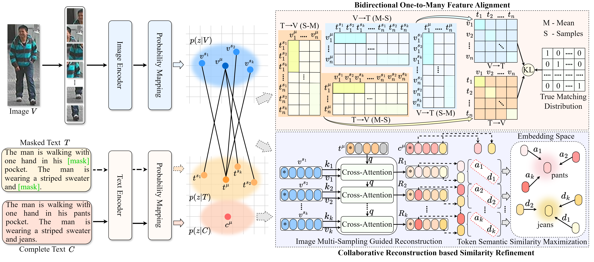

Code of paper "Cross-modal Person Retrieval with One-to-Many Relation Modeling"

# Methods


# Training
Our code borrows partially from IRRA and NAM. 
we use single RTX4090 24G GPU for training and evaluation.

# Weights
All training weights are being organized and will be released shortly.

# Testing
```
python test.py --config_file 'path/to/model_dir/configs.yaml'
```

# Cite
```
@inproceedings{jiang2023cross,
  title={Cross-modal implicit relation reasoning and aligning for text-to-image person retrieval},
  author={Jiang, Ding and Ye, Mang},
  booktitle={Proceedings of the IEEE/CVF conference on computer vision and pattern recognition},
  pages={2787--2797},
  year={2023}
}
@inproceedings{tan2024harnessing,
  title={Harnessing the power of mllms for transferable text-to-image person reid},
  author={Tan, Wentan and Ding, Changxing and Jiang, Jiayu and Wang, Fei and Zhan, Yibing and Tao, Dapeng},
  booktitle={Proceedings of the IEEE/CVF Conference on Computer Vision and Pattern Recognition},
  pages={17127--17137},
  year={2024}
}
```

